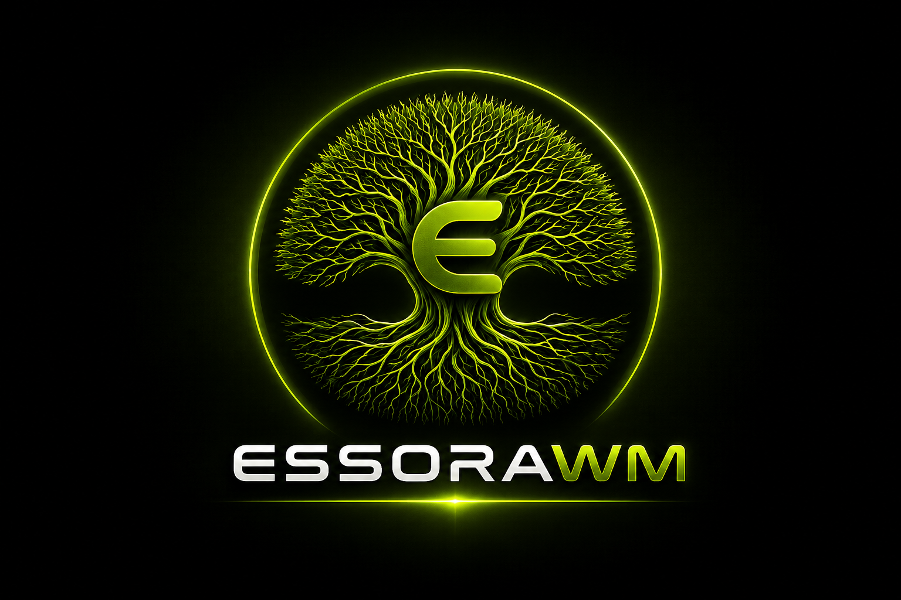
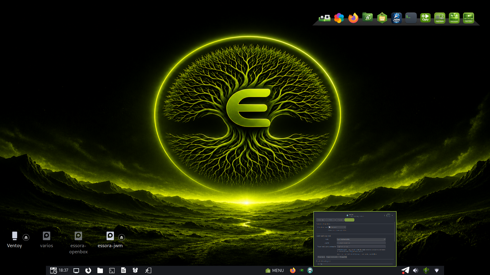
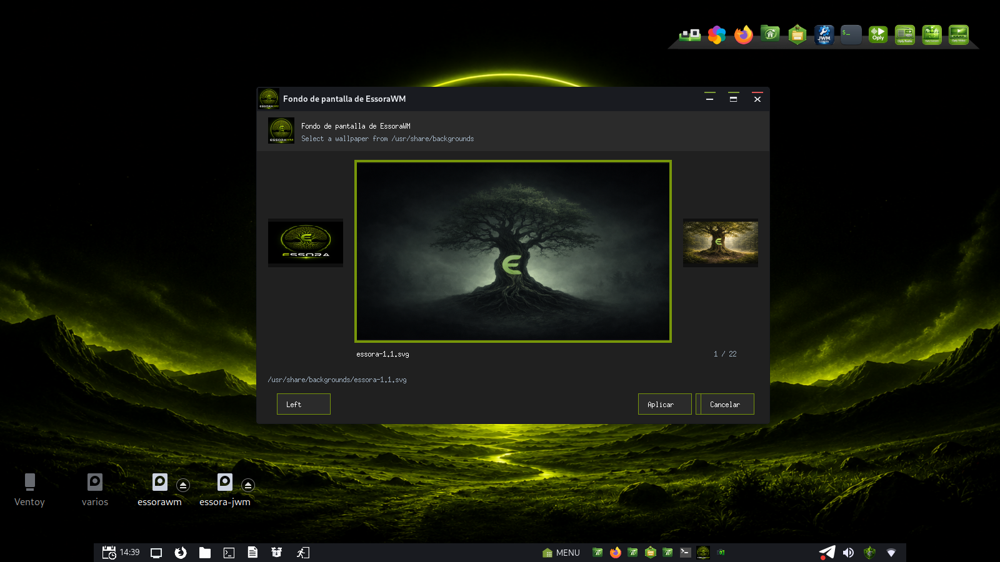
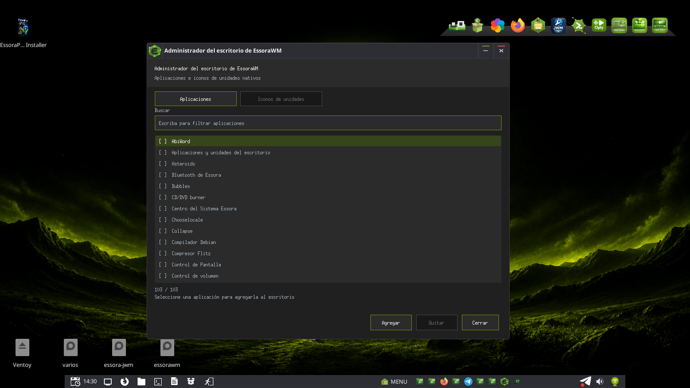

<p align="center">
  
</p>

<h1 align="center">EssoraWM</h1>

<p align="center">
  Fast, lightweight and customizable X11 window manager based on JWM.
</p>

<p align="center">
  <strong>EssoraWM 0.1.11</strong><br>
  Based on JWM 2.4.7
</p>

---

## About

EssoraWM is a fork of **JWM (Joe's Window Manager)** developed for Essora,
EssoraPup and Puppy Linux, while remaining usable on other X11 Linux
distributions.

It keeps the original JWM architecture, XML configuration format and
`/usr/bin/jwm` binary name for compatibility, and adds native Essora features
for the panel, task previews, desktop icons, drive handling, wallpapers,
translations, icon themes and Pymenu integration.

Standard JWM commands remain available:

```sh
jwm -restart
jwm -reload
jwm -version
```

Version output:

```text
EssoraWM 0.1.11
Based on JWM 2.4.7
```

EssoraWM is designed to use **Pymenu** as its primary application launcher:

```text
/usr/local/bin/pymenu
```

Pymenu is distributed separately and is not embedded in this repository.

---

## Main features

- Fast and lightweight X11 window manager based on JWM 2.4.7.
- Native task previews and thumbnail cache inside the panel.
- Compact task list focused on application icons and previews.
- Pymenu launcher integration.
- Native wallpaper manager with PNG, JPEG and SVG previews.
- Native desktop managed by the same `jwm` process.
- Desktop icons for applications, files, directories and drives.
- Persistent icon positions using the PuppyPin-compatible format.
- Native drive discovery, mounting, unmounting and opening.
- Configurable drive icon orientation, alignment, size and spacing.
- Themed icons for menus, submenus, desktop items and devices.
- Rounded desktop selection with a clean shadow effect.
- Automatic icon deselection after opening an application or drive.
- Multilingual desktop manager and JWM interface strings.
- Clean Debian package builder that does not pollute the Git source tree.

---

## Screenshots

### Task previews

Task previews are rendered directly by EssoraWM. No external thumbnail helper
is required.

<p align="center">
  
</p>

### Pymenu launcher

EssoraWM is designed to launch Pymenu from `/usr/local/bin/pymenu`.

<p align="center">
  
</p>

### Wallpaper manager

The native wallpaper manager is opened with:

```sh
jwm -wallpaper
```

<p align="center">
  
</p>

### Desktop and drive icon manager

EssoraWM includes a graphical configuration tool for managing desktop
applications and drive icons. It can be opened with:

```sh
jwm -desktop-icons
```

or:

```sh
jwm-desktop-icons
```

From this window users can add or remove desktop applications, show or hide
internal and removable drives, choose horizontal or vertical placement,
change alignment, icon size, spacing, offsets, labels and reverse order.

<p align="center">
  
</p>

---

## Native desktop

EssoraWM 0.1.11 includes its own native X11 desktop window. The desktop is
managed by the same `jwm` process, so neither ROX-Filer pinboard mode nor the
external `desktop_drive_icons` program is required.

For compatibility with Puppy Linux and existing desktop layouts, EssoraWM
reads and writes:

```text
$HOME/Choices/ROX-Filer/PuppyPin
```

The PuppyPin name is kept only as a compatible file format. EssoraWM does not
run `rox -p`.

Native desktop features include:

- Application, file, directory and drive icons.
- Single-click selection and double-click activation.
- Free icon movement with coordinates saved when the icon is released.
- Atomic PuppyPin updates.
- Automatic backup in `PuppyPin.essorawm-backup`.
- Rounded selection frame with a small shadow.
- Automatic deselection after opening an item.
- Context menus for opening, mounting, unmounting and removing icons.
- JWM root menu on empty desktop space.
- Automatic correction of icons left outside the visible screen after a
  resolution change.
- Internal desktop reload without restarting the window manager.

Open the desktop manager with:

```sh
jwm -desktop-icons
```

or:

```sh
jwm-desktop-icons
```

The desktop manager, shown in `assets/essorawm-config.png`, contains two
sections:

- **Applications:** search, add and remove desktop launchers.
- **Drive icons:** configure orientation, alignment, size, spacing, offsets,
  labels, label frames, reverse order and drive visibility.

Drive icons can also be moved manually. Their individual coordinates are
stored in PuppyPin.

---

## Drive icons

EssoraWM detects drives using `lsblk` and filters devices that should not be
shown on the desktop, including:

- Loop and zram devices.
- Swap partitions.
- EFI and Ventoy EFI partitions.
- SquashFS filesystems.
- AUFS and overlay layers.
- Internal Puppy Linux system layers.

The drive manager can show or hide:

- Internal drives.
- Removable and USB drives.
- Optical drives.
- Compatible network mount points.

Drive icon settings are compatible with EssoraFM. EssoraWM first reads:

```text
$HOME/.config/essorafm/config.ini
```

EssoraWM-specific overrides are stored in:

```text
$HOME/.config/essorawm/desktop.ini
```

Available layout controls include:

- Horizontal or vertical orientation.
- Left, center or right alignment.
- Top, middle or bottom alignment.
- Icon size.
- Horizontal and vertical spacing.
- Horizontal and vertical offsets.
- Labels and label frames.
- Normal or reversed order.
- Internal, removable and network drive visibility.

---

## File manager integration

Applications, folders and mounted drives are opened through:

```text
/usr/bin/essorawm-filemanager
```

On Puppy Linux, the launcher uses this conventional command first:

```text
/usr/local/bin/defaultfilemanager
```

On other distributions it can use:

1. `/etc/alternatives/file-manager`
2. `xdg-open`
3. `gio open`
4. `exo-open`
5. A commonly installed file manager such as EssoraFM, PCManFM, Thunar,
   SpaceFM, ROX-Filer, Nemo, Caja, Nautilus or Dolphin.

The Debian package does not replace an existing Puppy
`/usr/local/bin/defaultfilemanager`. If the path does not exist, the package
creates a compatibility link to `essorawm-filemanager`.

---

## Wallpaper manager

The wallpaper manager searches images in:

```text
/usr/share/backgrounds
```

The selected wallpaper path is saved in:

```text
$HOME/.config/essorawm/wallpaper
```

Open the manager:

```sh
jwm -wallpaper
```

Restore the saved wallpaper:

```sh
jwm -wallpaper-restore
```

Supported preview formats include:

- PNG
- JPEG
- SVG

SVG images are loaded directly when EssoraWM is compiled with Cairo and
librsvg support. If native SVG support is unavailable, `rsvg-convert` is used
as the preferred fallback. Inkscape and ImageMagick can be used as additional
fallbacks.

The wallpaper is applied using the first available supported setter:

- `hsetroot`
- `feh`
- `xwallpaper`

EssoraWM also updates the compatible PuppyPin `<backdrop>` entry and reloads
the native desktop without starting ROX-Filer.

---

## Menu and icon handling

EssoraWM resolves both icon names and absolute image paths. Theme lookup
includes the standard icon categories:

```text
apps
 devices
 places
 actions
 categories
 mimetypes
 status
 emblems
```

This lookup is used by:

- Main menu items.
- Submenus.
- Desktop applications.
- Drive icons.
- Desktop context-menu actions.

SVG menu and desktop icons use native librsvg support when available and the
same safe conversion fallback used by the wallpaper manager otherwise.

---

## Commands added by EssoraWM

```sh
jwm -wallpaper          # Open the wallpaper manager
jwm -wallpaper-restore  # Restore the saved wallpaper
jwm -desktop-icons      # Manage applications and drive icons
```

Standard JWM commands remain compatible:

```sh
jwm -restart
jwm -reload
jwm -version
```

---

## Translations

EssoraWM keeps JWM gettext support and includes translations for:

```text
ar ca da de es fr hu it ja ka lt nl pl pt pt_BR ru th tr uk zh_CN zh_TW
```

English is the fallback language.

The desktop manager, drive settings, desktop context menus and the new Essora
commands use the same translation system.

---

## Building EssoraWM

The Git repository intentionally excludes generated Autotools files, object
files, compiled translations, binaries and Debian staging trees.

The included package builder generates all temporary compilation files under
`${TMPDIR:-/tmp}`, leaving the repository clean.

### Build dependencies

On Debian, Devuan or a compatible distribution:

```sh
apt install build-essential autoconf automake gettext pkg-config \
  libx11-dev libxext-dev libxrender-dev libxmu-dev libxinerama-dev \
  libxpm-dev libjpeg-dev libpng-dev libcairo2-dev librsvg2-dev \
  libxft-dev libpango1.0-dev
```

Puppy Linux normally runs as root, so `sudo` is not required.

### Compile and create the Debian package

```sh
chmod +x build-essora-jwm-deb.sh
./build-essora-jwm-deb.sh
```

The generated package is written to:

```text
deb-output/essorawm_0.1.11_<architecture>.deb
```

Temporary configuration files, objects and the package staging tree are
removed automatically after the build.

### Manual build

```sh
./autogen.sh
./configure --prefix=/usr --sysconfdir=/etc --localstatedir=/var
make -j"$(nproc)"
```

Install manually:

```sh
make install
```

Return a manually built checkout to a clean state with:

```sh
make distclean
```

---

## Runtime recommendations

Recommended optional runtime tools:

```text
hsetroot | feh | xwallpaper
udisks2
librsvg2-bin
xdg-utils
```

Pymenu is expected at:

```text
/usr/local/bin/pymenu
```

---

## Source layout

```text
src/                     Window manager and native desktop source
po/                      Gettext translations
contrib/                 Icons and desktop entries
scripts/                 Wallpaper, desktop and file-manager launchers
assets/                  Project image and screenshots
tools/                   Translation maintenance helpers
example.jwmrc             Default EssoraWM configuration
build-essora-jwm-deb.sh  Clean Debian package builder
```

Essora-specific additions in the source are marked with comments such as:

```c
/* agregado por josejp2424 */
```

---

## Original project

EssoraWM is based on **JWM (Joe's Window Manager)**.

- Original author: **Joe Wingbermuehle**
- Original project: <https://joewing.net/projects/jwm/>
- License: **MIT**

---

## EssoraWM

Essora modifications and integration:

**josejp2424**

Project repository:

<https://github.com/josejp2424/essorawm>

## Runtime diagnostic log

This source includes a lightweight runtime trace for desktop, wallpaper and
`wbar` problems. It is disabled by default and can be enabled without
restarting EssoraWM:

```sh
essorawm-debug start
```

Reproduce the problem, then stop tracing and keep the log:

```sh
essorawm-debug stop
essorawm-debug collect
```

The default log is `/tmp/essorawm-debug-UID.log`. The trace records wallpaper
window expose/configure events, native desktop reloads and redraws, drive
signature changes, and the number of `wbar` processes before and after a
wallpaper change.
